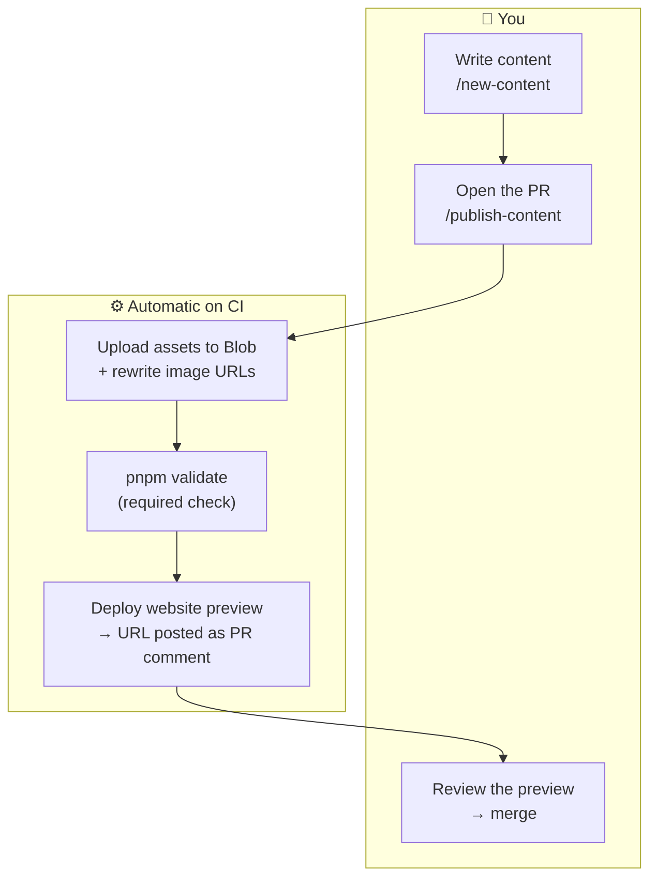

# Ocobo Posts Repository

Content repository for Ocobo blog posts, client stories, and assets.

## How this repo relates to `ocobo-revops/website`

This repo is the **source of truth for all content** (markdown files + assets). The website (`ocobo-revops/website`) is a pure read-side consumer — it never writes here, and it never needs to redeploy when content changes.

For the full architecture (system diagram, content flow, asset flow, repo-boundary decision table), see the canonical reference in the website repo:

**[docs/architecture/two-repo-content-pipeline.md](https://github.com/ocobo-revops/website/blob/main/docs/architecture/two-repo-content-pipeline.md)**

---

## Adding content

Content is authored through Claude Code skills — no CMS, no manual frontmatter.

### Prerequisites

```bash
pnpm install
```

That's all you need to start. Notion import is **optional** — if you want to pull a draft from a Notion page, follow [`docs/mcp-notion-setup.md`](docs/mcp-notion-setup.md) to connect the Notion MCP. Otherwise, interview mode works immediately.

**New contributor on a fresh macOS machine?** Run `/setup` in Claude Code — it installs and checks everything (Homebrew, Node 24, pnpm 8, GitHub CLI auth, dependencies) and leaves you ready to run `/new-content`.

### The commands

| Command | Purpose |
|---------|---------|
| `/setup` | One-time macOS onboarding — install/check Homebrew, Node 24, pnpm 8, GitHub CLI auth, dependencies. |
| `/new-content [--type X] [source]` | Create a new blog post, story, team member, tool, or job. |
| `/publish-content` | Validate the new file and open a PR against `main`. |
| `/translate-content` | Translate an existing content file to the other language. |

Canonical flow: **`/new-content` → `/publish-content` → review the preview**. `/publish-content` opens the PR; CI then uploads assets to Vercel Blob, rewrites local image paths to Blob URLs, runs `pnpm validate` as a required check, and deploys a website preview — the preview URL is posted as a comment on the PR for you to review before merging.



### Three source modes for `/new-content`

1. **Interview** — `/new-content` (or `/new-content --type blog-post`). Claude walks you through the required fields. No external source needed.
2. **Local file** — `/new-content path/to/draft.md`. Pre-fills fields from a local markdown draft; the interview only asks for what's missing.
3. **Notion URL** — `/new-content https://notion.so/...`. Pre-fills from a Notion page (requires the optional MCP setup above).

---

## Assets

You don't need to manage assets by hand. Drop images alongside your content and publish through `/publish-content` — CI uploads them to Vercel Blob, rewrites local paths to CDN URLs, and optimises oversized images automatically. No website rebuild is needed when content or assets change.

Doing bulk imports, debugging an upload, or working outside the content skills? See [`docs/asset-management.md`](docs/asset-management.md) for the local commands, token setup, and asset directory structure.
